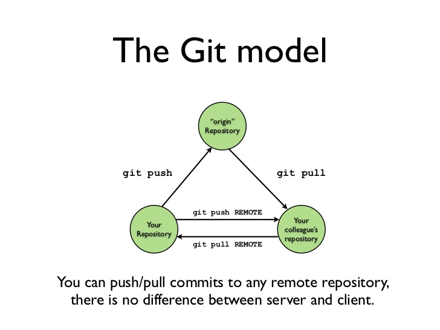

# Introduction to `git` and GitHub


---

# What is git?

Git is a 'version control system' (VCS) that lets you take 'snapshots' of your files as you develop them. 

Git is constrained to a single project folder called "repository" or "repo"

---

# Create a GitHub Account

[GitHub Link](http://github.com)

---

# Setup

## Install git

```bash
$ sudo apt install git
```

## Tell git who you are:
```
$ git config --global user.name "John Doe"
$ git config --global user.email johndoe@example.com
```

---

# Create a new repository:

## `git init`


---

# Git "areas"


  - Move to staging with `git add`
  - Move to .git with `git commit`

---

# Check the contents of git

`git status`: View changed files
`git log --oneline` View list of commits
`git diff` See what changes have been made

---

# "`push`ing" repos to GitHub

  1. Create new repo on GitHub
  2. `git remote add origin <<url>>`
  3. `git push -u origin master`

---

# Download online git repos

`git clone`

[https://github.com/tiimgreen/github-cheat-sheet](https://github.com/tiimgreen/github-cheat-sheet)


---

# `git push` and `git pull` 



---

# GitHub assignments

Sample Assignment: [https://classroom.github.com/a/eGrKvzEA](https://classroom.github.com/a/eGrKvzEA)

Follow instructions to complete your forst GitHub assignment
